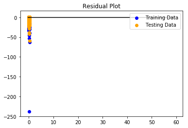
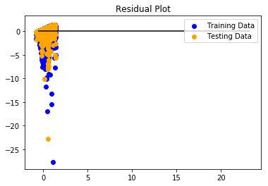
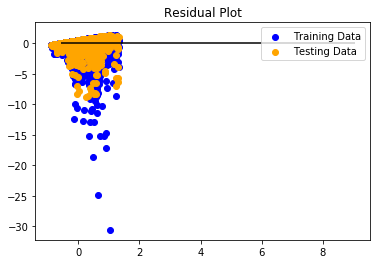

# final-project

For our final project, we created a program that tries to predict product sales at South American grocery stores for the day before and the day after Christmas.

This would hopefully be used to identify the products that should be stocked up on for the rush, and avoiding products
that don't sell as well.

WE used SQL as our database to store and clean our millions of rows of data, Scikit-Learn as our Machine Learning package, MatPlotLib to display our results, Tableau for an interactive dashboard to explain those results, and HTML as a way to share our findings on the front end.

